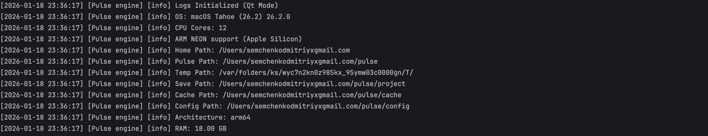
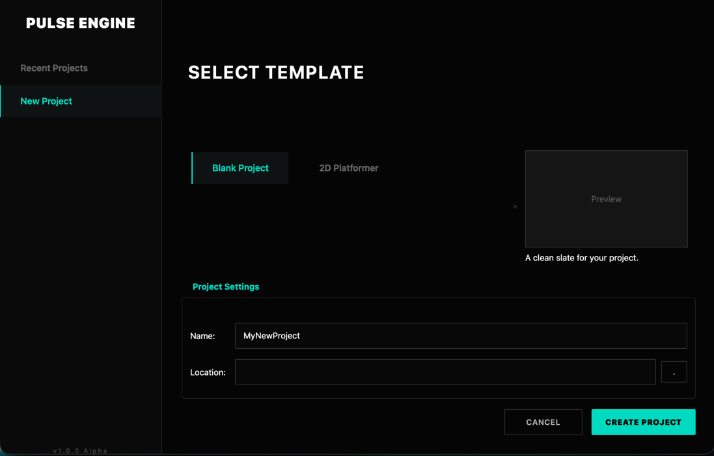
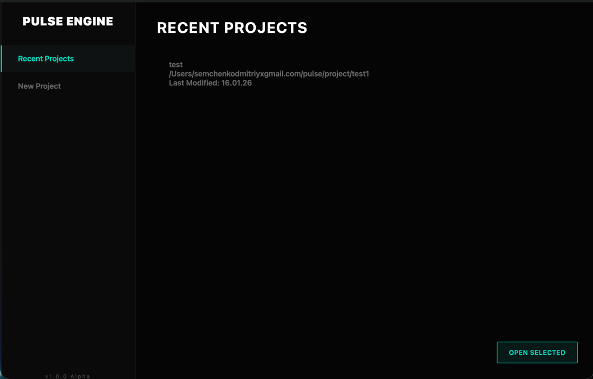
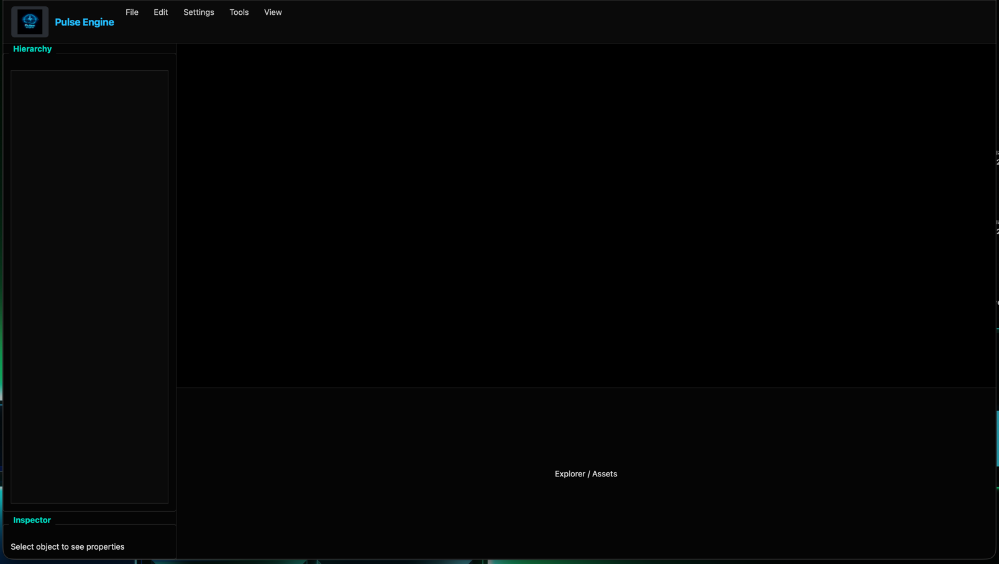

# 🎮 Pulse Engine

  

**Pulse Engine** is a custom, high-performance game and simulation engine written in C++.
Started as a passion project to explore **system architecture**, **physics simulations**, and **advanced mathematics** integration in software.

> ⚠️ **Note:** The project is currently in the early stages of development (Alpha). Architecture is subject to change.

## 🎯 Goals
* Build a robust ECS (Entity Component System).
* Implement custom memory management.
* Create a physics sandbox for simulation purposes.
* Transition from 2D (SFML) to high-performance 3D rendering (Vulkan).

## 🛠 Tech Stack
* **Core:** C++23
* **Windowing/Input:** SFML (Current), Qt (Tools)
* **Build System:** CMake
* **Scripting:** Python (Planned)

## 💻 System Requirements
Since the engine uses modern C++ features, you will need:
* **Compiler:** GCC 13+, Clang 16+, or MSVC 2022 (supports C++23).
* **CMake:** Version 3.25 or higher.
* **Libraries:** SFML 2.6+, Qt6 (for tools).

## 🗺 Roadmap
- [x] Project Setup & CMake configuration
- [x] Basic Window Loop & Event Handling
- [ ] Mathematical Vector/Matrix Library implementation
- [ ] 2D Renderer (Sprite/Shapes)
- [ ] Simple Physics (Collision Detection)
- [ ] Resource Manager
- [ ] Basic object scripting
- [ ] Project builder

## 🏗️ Current State & UI Prototype

### System Log & Initialization
*Terminal log showing system startup sequence.*
<br>


### Editor Interface
*Project Browser and Main Window prototypes.*

<p align="center">
  
</p>
<p align="center">
  
  
</p>


## 🚀 Getting Started
```bash
git clone [https://github.com/AKUMA365/Pulse-Engine.git](https://github.com/AKUMA365/Pulse-Engine.git)
cd Pulse-Engine
mkdir build && cd build
cmake ..
make